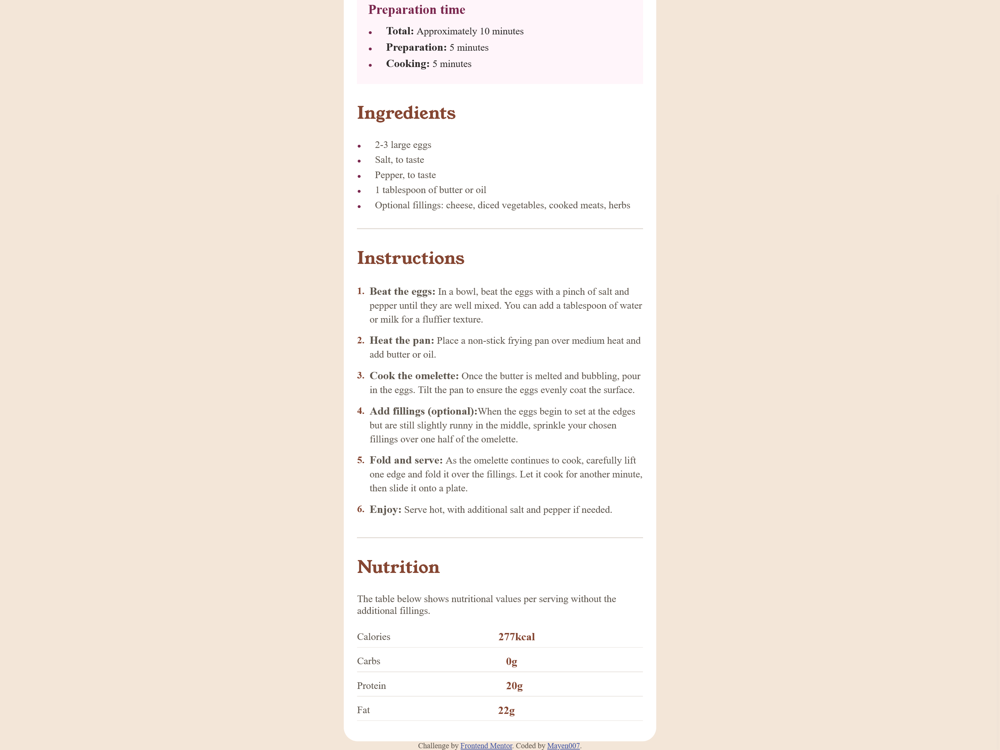
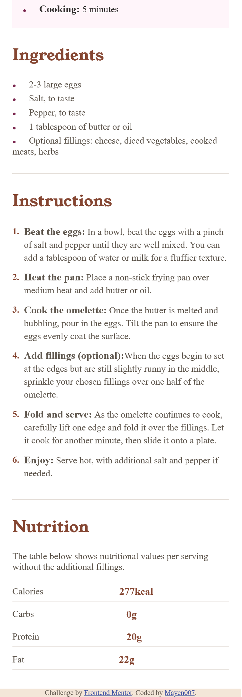

# Frontend Mentor - Recipe Page Solution

This is a solution to the [Recipe Page challenge on Frontend Mentor](https://www.frontendmentor.io/challenges/recipe-page-KiTsR8QQKm). This project showcases a simple yet elegant recipe page for making an omelette, focusing on responsive design and clean, semantic HTML.

## Table of contents

- [Overview](#overview)
  - [Screenshot](#screenshot)
  - [Links](#links)
- [Project Description](#project-description)
- [My Process](#my-process)
  - [Built With](#built-with)
  - [Key Learnings](#key-learnings)
  - [Future Improvements](#future-improvements)
  - [Resources](#resources)
- [Author](#author)
- [Acknowledgments](#acknowledgments)

## Overview

### Screenshot





### Links

- **Solution URL:** [GitHub Repository](https://github.com/Mayen007/Recipe-Page)
- **Live Site URL:** [Live Demo](https://mayen007.github.io/Recipe-Page/)

## Project Description

This project is a responsive recipe page for a simple omelette. The page includes an overview of the recipe, preparation and cooking instructions, a list of ingredients, and nutritional information. It is designed to be clean, accessible, and easy to navigate, making it a quick reference for anyone looking to prepare a classic omelette.

### Features

- **Preparation Time Section**: Displays total, preparation, and cooking times.
- **Ingredients List**: Includes options for customizing the omelette with various fillings.
- **Step-by-Step Instructions**: Easy-to-follow steps with visual cues.
- **Nutritional Information**: A summary of calories, carbs, protein, and fat per serving.

## My Process

### Built With

- **HTML5** - For semantic markup
- **CSS** - For styling with custom properties (variables) and responsive design
- **Flexbox** - For layout structuring
- **JavaScript (optional)** - For potential interactive enhancements (if any in future)
- **Mobile-first approach** - Ensuring responsiveness across various devices

### Key Learnings

Working on this project helped me solidify my understanding of responsive design and semantic HTML. Key takeaways include:

1. **Use of Semantic HTML Elements**: Implementing elements like `<section>`, `<article>`, and `<main>` for better accessibility and SEO.
   ```html
   <article>
     <h2>Recipe Name</h2>
     <p>A classic omelette recipe for all occasions.</p>
   </article>
   ```

## Continued Development

- **JavaScript Interactivity**:
  - Adding interactive features like a "favorite recipe" button or a toggle for showing/hiding nutritional information.
- **Accessibility Enhancements**:
  - Improving accessibility by adding ARIA roles and ensuring keyboard navigation support.
- **Expanded Recipe Collection**:
  - Extending the page to include more recipes, potentially turning it into a full recipe site.

## Useful Resources

- [CSS Tricks - A Complete Guide to Flexbox](https://css-tricks.com/snippets/css/a-guide-to-flexbox/)
- [MDN Web Docs - HTML Elements](https://developer.mozilla.org/en-US/docs/Web/HTML/Element)
- [The Markdown Guide](https://www.markdownguide.org/)

## Author

- **GitHub** - [Mayen007](https://github.com/Mayen007)
- **Frontend Mentor** - [@Mayen007](https://www.frontendmentor.io/profile/Mayen007)

## Acknowledgments

Special thanks to the Frontend Mentor community for providing challenges that enhance coding skills through practical projects.
